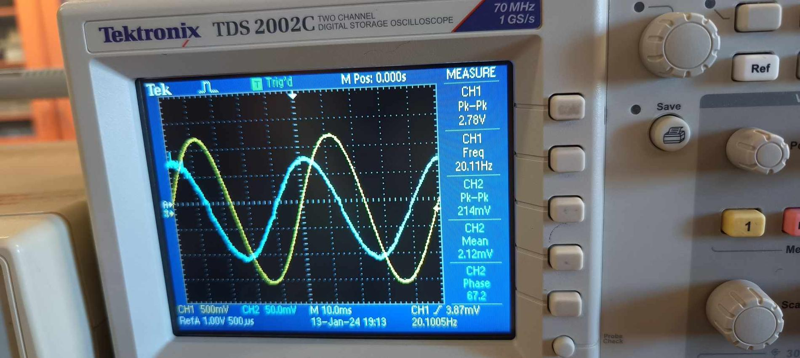
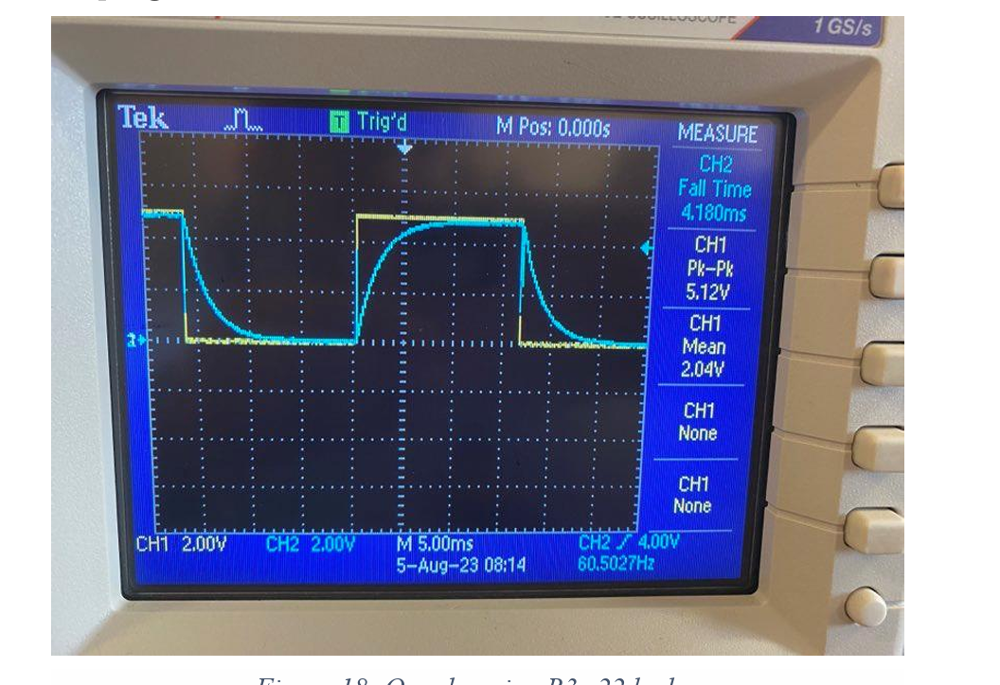
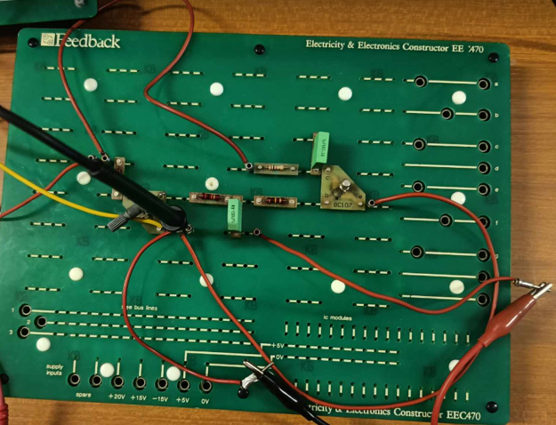
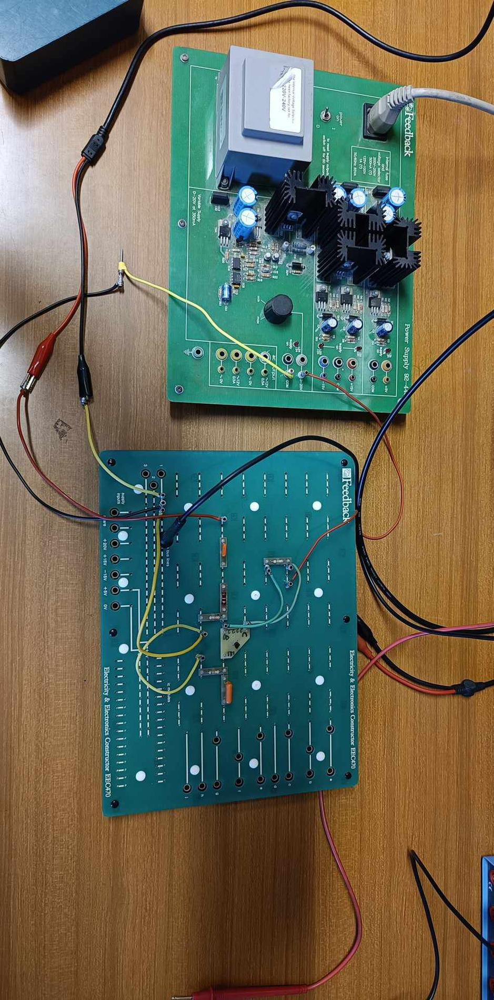

# Hardware and Systems Documentation — Technical Writing & Engineering Reporting Portfolio


> A **technical-writing and engineering-reporting portfolio** of six formal Birzeit University lab reports spanning **microcontroller interfacing, digital and analog electronics, signals and systems, and communications** — published to demonstrate that I can not only build hardware but clearly document what I built and why.

---

## Architecture & Key Features

This repository is intentionally documentation-only. Each PDF follows the same disciplined report structure:

1. **Stated objective** — what the experiment is meant to prove.
2. **Theoretical background** with cited equations and reference figures.
3. **Experimental setup** — circuit diagrams, MATLAB code listings, IC pinouts, or wiring tables.
4. **Observed results** — measured data presented in numbered tables and figures.
5. **Discussion** — ties measured vs theoretical values back to course theory and flags discrepancies.

### Domains covered

- **Microcontrollers & Embedded Interfacing** — Arduino + UART + I2C (ENCS5140 Real-Time Systems Lab).
- **Digital Electronics** — Encoders, decoders, multiplexers, demultiplexers (ENCS2110 Digital Lab).
- **Analog Circuits & Filter Theory** — RL/RC/RLC time response and passive/active filter characterisation (ENEE2103 Circuits & Electronics Lab).
- **Signals & Systems** — MATLAB step / pulse / rectangular-pulse generation and analysis (Signals course project).
- **Communications** — Fourier-series decomposition and single-sideband AM modulation (ENEE3309 Communication Systems).

### Repository Layout

```
.
├── README.md
├── .gitignore
└── reports/
    ├── arduino_uart_i2c_interfacing_realtime_systems_lab_report.pdf
    ├── digital_lab_encoders_decoders_mux_demux_exp3_report.pdf
    ├── circuits_electronics_first_second_order_rlc_response_exp3_report.pdf
    ├── circuits_electronics_passive_active_filters_exp5_report.pdf
    ├── signals_matlab_step_pulse_generation_project_report.pdf
    └── communication_systems_fourier_series_ssb_modulation_report.pdf
```

### Report Index

| Report | Course | Domain |
| --- | --- | --- |
| [`arduino_uart_i2c_interfacing_realtime_systems_lab_report.pdf`](reports/arduino_uart_i2c_interfacing_realtime_systems_lab_report.pdf) | ENCS5140 — Real-Time Systems & Interfacing Lab | Microcontroller + UART + I2C |
| [`digital_lab_encoders_decoders_mux_demux_exp3_report.pdf`](reports/digital_lab_encoders_decoders_mux_demux_exp3_report.pdf) | ENCS2110 — Digital Laboratory | Digital electronics |
| [`circuits_electronics_first_second_order_rlc_response_exp3_report.pdf`](reports/circuits_electronics_first_second_order_rlc_response_exp3_report.pdf) | ENEE2103 — Circuits & Electronics Lab | Analog circuits (transient response) |
| [`circuits_electronics_passive_active_filters_exp5_report.pdf`](reports/circuits_electronics_passive_active_filters_exp5_report.pdf) | ENEE2103 — Circuits & Electronics Lab | Analog filters |
| [`signals_matlab_step_pulse_generation_project_report.pdf`](reports/signals_matlab_step_pulse_generation_project_report.pdf) | Signals & Systems — Course Project | Continuous-time signals |
| [`communication_systems_fourier_series_ssb_modulation_report.pdf`](reports/communication_systems_fourier_series_ssb_modulation_report.pdf) | ENEE3309 — Communication Systems | Fourier analysis + AM modulation |

### A note on provenance

Every PDF is preserved exactly as submitted — including the original Birzeit University cover page, instructor name, and submission date. That is intentional: tampered PDFs are a credibility risk; original PDFs are independently verifiable against my transcript.

---

## Lab Gallery

A small visual companion to the report archive — bench photos and oscilloscope captures from the same lab sessions that produced the PDFs above.

<div align="center">

<table>
  <tr>
    <td align="center" width="50%">
      
      <br /><sub><b>Analog domain</b> &mdash; sine-wave capture from the bench oscilloscope (Circuits &amp; Electronics Lab).</sub>
    </td>
    <td align="center" width="50%">
      
      <br /><sub><b>Digital domain</b> &mdash; square wave verifying clean logic-level transitions.</sub>
    </td>
  </tr>
  <tr>
    <td align="center" width="50%">
      
      <br /><sub><b>Digital Logic Trainer</b> &mdash; combinational circuit wired on the trainer kit (Digital Lab Exp. 3).</sub>
    </td>
    <td align="center" width="50%">
      
      <br /><sub><b>Integrated build</b> &mdash; top-down view of a custom PCB assembled during lab work.</sub>
    </td>
  </tr>
</table>

<br />

<h3>Hardware Interrupt Demonstration</h3>

<video src="assets/hardware_interrupt_button_demo.mp4"
       controls muted autoplay loop playsinline
       width="720">
  Your browser does not support embedded video.
  <a href="assets/hardware_interrupt_button_demo.mp4">Download the clip</a>.
</video>

<p><sub>Push-button event triggering an MCU interrupt service routine on the target board.</sub></p>

</div>

> Note: GitHub's Markdown renderer does not execute the `<video>` attributes inline; the clip plays inline on platforms that allow raw HTML5 (Pages, docs sites) and is available as a download link on github.com itself.

---

## Co-Author Consent

Four of the six reports are co-authored and are published here with the explicit consent of every collaborator listed below. The remaining two (`signals_matlab_step_pulse_generation_project_report.pdf`, `communication_systems_fourier_series_ssb_modulation_report.pdf`) are solo work.

| Report | Co-authors |
| --- | --- |
| `arduino_uart_i2c_interfacing_realtime_systems_lab_report.pdf` | Jana Herzallah (1201139), Lana Badwan (1200071) |
| `digital_lab_encoders_decoders_mux_demux_exp3_report.pdf` | Mohammad Makhamri (1200227) |
| `circuits_electronics_first_second_order_rlc_response_exp3_report.pdf` | Jana Herzallah (1201139), Lana Badwan (1200071), Jana AbuNasser (1201110) |
| `circuits_electronics_passive_active_filters_exp5_report.pdf` | Jana Herzallah (1201139), Lana Badwan (1200071) |
